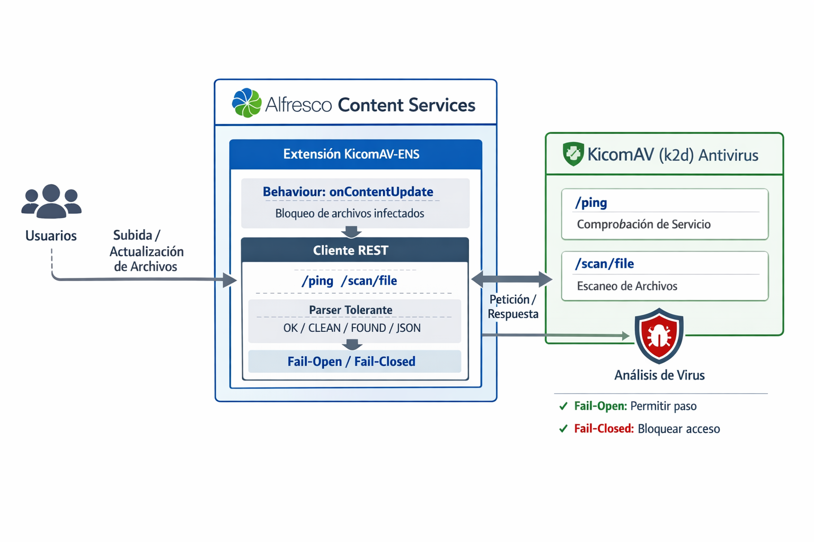

# Alfresco - KicomAV - ENS

Módulo/extensión para **Alfresco Content Services (ACS)** que integra el antivirus **KicomAV (k2d)** para **escanear automáticamente** el contenido durante la **subida** o **actualización** de archivos. El objetivo es impedir que contenido malicioso llegue a quedar disponible en el repositorio.

## Características

- **Escaneo automático** de contenido al subir/actualizar (behaviour `onContentUpdate`).
- **Bloqueo de archivos infectados** y registro del resultado del análisis.
- **Cliente REST** hacia KicomAV (k2d) con endpoints:
  - `GET /ping` (healthcheck del servicio)
  - `POST /scan/file` (escaneo del archivo)
- **Parser tolerante** de respuestas (por ejemplo: `OK/CLEAN`, estilo `FOUND`, y/o `JSON`).
- **Política configurable ante fallos** del servicio AV:
  - **Fail-open**: permite el flujo si el AV no responde.
  - **Fail-closed**: bloquea el flujo si el AV no responde (recomendado para entornos de alta seguridad).
- **Logs** claros para auditoría y trazabilidad.

## Cumplimiento con el Esquema Nacional de Seguridad (ENS)

Este módulo está diseñado para facilitar el cumplimiento del **Esquema Nacional de Seguridad (ENS)** al incorporar un **control preventivo** frente a código malicioso en el ciclo de vida del contenido.

En particular, aporta medidas alineadas con:
- **Protección frente a malware**: detección y bloqueo de contenido potencialmente dañino.
- **Prevención y contención**: evita que archivos infectados queden accesibles en el repositorio.
- **Trazabilidad y auditoría**: registro de eventos de escaneo y resultados para seguimiento.
- **Configurabilidad de postura de seguridad**: opción **fail-closed** para endurecer la operación en entornos con requisitos ENS más exigentes.

> Nota: El cumplimiento ENS completo depende también de la configuración del entorno (ACS, infraestructura, redes, copias, monitorización, gestión de identidades, etc.). Este módulo contribuye específicamente a la **medida de protección contra software malicioso** y a la **reducción del riesgo** asociado al contenido.

## Arquitectura

La integración se basa en un behaviour dentro de Alfresco que intercepta actualizaciones de contenido y deriva el archivo al servicio KicomAV (k2d) para su análisis antes de permitir su disponibilidad.



### Flujo general

1. El usuario (o proceso) **sube/actualiza** un documento en Alfresco.
2. El behaviour `onContentUpdate` intercepta el evento.
3. El módulo llama al **cliente REST**:
   - (Opcional) `GET /ping` para verificar disponibilidad.
   - `POST /scan/file` para analizar el contenido.
4. Según el resultado:
   - **CLEAN/OK**: se permite el flujo normal.
   - **INFECTED/FOUND**: se bloquea el contenido y se registra el evento.
   - **ERROR/Timeout**: se aplica la política configurada (**fail-open** o **fail-closed**).

## Requisitos

- Alfresco Content Services (ACS) compatible con behaviours.
- Servicio antivirus **KicomAV (k2d)** accesible por red desde ACS (host/puerto configurables).
- Java y herramienta de construcción (Maven/Gradle) según el proyecto.

## Configuración

Los parámetros exactos pueden variar según tu despliegue, pero típicamente incluirán:

- URL/host/puerto del servicio KicomAV (k2d)
- Timeout de conexión/lectura
- Política ante fallo: `fail-open` / `fail-closed`
- (Opcional) rutas o reglas del motor AV si aplica en tu despliegue

> Recomendación ENS: en entornos con mayor criticidad, usar **fail-closed** y monitorizar la disponibilidad del servicio AV.

Propiedades alfresco-global.properties
```
# KicomAV daemon base URL
av.kicomav.baseUrl=http://kicomav:8311

# Timeouts (ms)
av.kicomav.connectTimeoutMs=5000
av.kicomav.readTimeoutMs=60000
av.kicomav.failOpen=false
```

## Construcción Antivirus

```
FROM python:3.12-slim

ENV PYTHONUNBUFFERED=1 \
    PIP_NO_CACHE_DIR=1 \
    PIP_DISABLE_PIP_VERSION_CHECK=1

ENV K2D_HTTP_HOST=0.0.0.0 \
    K2D_HTTP_PORT=8311 \
    K2D_SOCKET_PORT=3311

ENV SYSTEM_RULES_BASE=/var/lib/kicomav/rules \
    USER_RULES_BASE=/var/lib/kicomav/user-rules

RUN apt-get update && apt-get install -y --no-install-recommends \
      ca-certificates \
    && rm -rf /var/lib/apt/lists/*
RUN useradd -m -u 10001 -s /bin/bash kicomav
RUN mkdir -p /var/lib/kicomav/rules /var/lib/kicomav/user-rules \
    && chown -R kicomav:kicomav /var/lib/kicomav
RUN mkdir -p /var/run/kicomav \
    && chown -R kicomav:kicomav /var/run/kicomav
RUN pip install "kicomav[daemon]"

USER kicomav
WORKDIR /home/kicomav

RUN mkdir -p /home/kicomav/.kicomav \
    && touch /home/kicomav/.kicomav/.env

EXPOSE 8311 3311

HEALTHCHECK --interval=15s --timeout=3s --retries=10 CMD python -c \
"import urllib.request; urllib.request.urlopen('http://127.0.0.1:8311/ping').read(); print('ok')" || exit 1

CMD ["k2d"]
```
